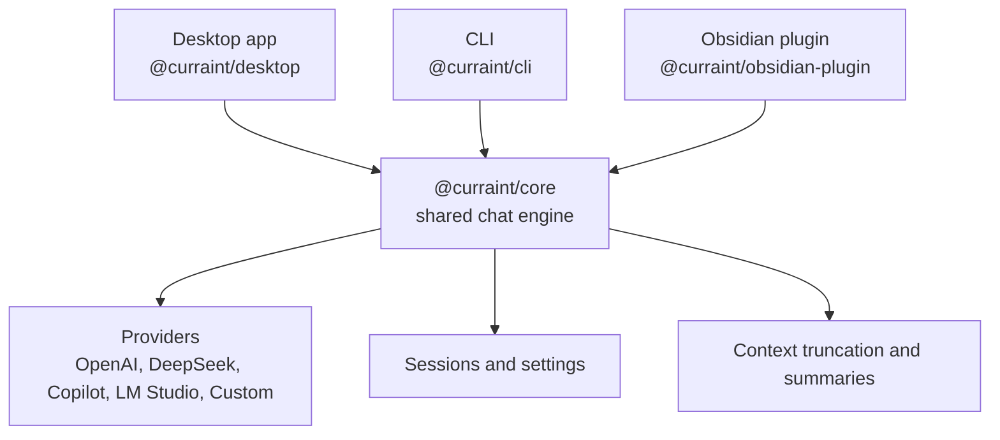

# curraint

[](LICENSE)


> [!CAUTION]
> **Early alpha: expect breaking changes.** curraint is under active development.
> APIs, configuration format, storage layout, and behavior can change significantly
> between releases without prior notice. Do not rely on it in production environments.

> [!TIP]
> **One core. Three interfaces.** curraint keeps the same chat flow across a tray-first desktop app, a terminal CLI, and an Obsidian sidebar.

curraint is an AI chat client built around a shared TypeScript core. Use the desktop app when you want a fast tray workflow, the CLI when you want scripting and terminal control, and the Obsidian plugin when your work already lives in notes. All three surfaces share the same chat engine, so streaming, edit and regenerate, context safety, provider behavior, and session handling stay consistent.

[Why curraint](#why-curraint) · [Alpha status](#alpha-status) · [Choose your interface](#choose-your-interface) · [Quick start](#quick-start) · [How it works](#how-curraint-works) · [Security](#security-and-storage) · [Development](#development)

## Alpha status

curraint is still in early alpha. The user-facing packages in this repo are not all equally validated across platforms yet, and some combinations have not been tested at all.

| Interface | Windows | macOS | Mobile |
|---|---|---|---|
| Desktop | Verified | Not yet verified | Not applicable |
| CLI | Verified | Verified | Not applicable |
| Obsidian plugin | Verified | Not yet verified | Not yet tested |

Status legend:

- **Verified**: known usable based on current manual testing.
- **Not yet verified**: may work, but has not been confirmed yet in this alpha.
- **Not yet tested**: no validation has been done yet.
- **Not applicable**: that interface is not intended for that platform.

## Why curraint

Most AI chat tools make you choose one surface and live with its tradeoffs. curraint is built around a different idea: the interface can change, but the chat behavior should not.

- **Tray-first when speed matters.** Open chat without hunting for a window.
- **Terminal-first when automation matters.** Keep prompts and results in the same place as the rest of your workflow.
- **Vault-aware when notes matter.** Pull active or selected Obsidian notes directly into the conversation.
- **Same conversation controls everywhere.** Stream responses, stop mid-generation, edit earlier messages, and regenerate from that point.
- **Hosted or local models.** Use OpenAI, DeepSeek, GitHub Copilot, LM Studio, or any OpenAI-compatible endpoint.
- **Context safety built in.** Long chats are truncated safely with a summary fallback instead of failing abruptly.

## Choose your interface

| Interface | Best for | Highlights | Package |
|---|---|---|---|
| Desktop | Fast day-to-day chat from anywhere on your machine | Tray popover, global quick input, settings UI, unread indicator, packaged app builds | `@curraint/desktop` |
| CLI | Terminal sessions, scripting, and keyboard-driven workflows | Streaming terminal output, slash commands, edit and retry flow, environment-based config | `@curraint/cli` |
| Obsidian | Conversations tied to notes and vault context | Sidebar chat, active note injection, note picker, concurrent conversations, Obsidian-native settings | `@curraint/obsidian-plugin` |
| Core | Shared chat behavior across every surface | Providers, sessions, settings, encryption, context truncation, think-tag parsing | `@curraint/core` |

## Architecture



## Shared behavior across interfaces

| Capability | Desktop | CLI | Obsidian |
|---|---|---|---|
| Streaming responses | Yes | Yes | Yes |
| Stop and keep partial output | Yes | Yes | Yes |
| Edit a previous user message and regenerate | Yes | Yes | Yes |
| Optional session saving | Yes | Yes | Yes |
| Context truncation with summary fallback | Yes | Yes | Yes |
| OpenAI-compatible providers | Yes | Yes | Yes |
| Markdown rendering | Yes | Yes | Yes |
| LM Studio local models | Yes | Yes | Yes |
| Note context injection | No | No | Yes |

## Quick start

### Requirements

- Node.js 22+
- pnpm 10+
- Obsidian, if you want to use the plugin

### Install dependencies

```bash
pnpm install
```

### Build everything

```bash
pnpm build
```

### Run the desktop app

```bash
pnpm desktop
```

Desktop highlights:

- Left-click the tray icon to open or close the chat popover.
- Right-click the tray icon for `Open Chat`, `Settings`, and `Quit`.
- Use the optional global quick input shortcut to open a floating input bar from anywhere.

### Run the CLI

Set environment variables:

| Variable | Required | Default | Notes |
|---|---|---|---|
| `CURRAINT_PROVIDER` | No | `openai` | `openai`, `deepseek`, `copilot`, `lmstudio`, or `custom` |
| `CURRAINT_API_KEY` | OpenAI only | None | Optional for LM Studio and custom endpoints |
| `CURRAINT_BASE_URL` | No | `https://api.openai.com/v1` | Point to LM Studio or any OpenAI-compatible API |
| `CURRAINT_MODEL` | No | `gpt-4o-mini` | Any model your endpoint supports |
| `CURRAINT_SYSTEM_PROMPT` | No | None | Optional system prompt |

Run the CLI:

```bash
pnpm cli
```

CLI behavior:

- Streaming, stop, edit, and regenerate use the same core behavior as desktop.
- Conversation history is not saved by default.
- Use `/sessions-save on` to persist sessions and `/sessions` to browse and resume them.
- Press `Ctrl+C` while streaming to stop the current response.

<details>
<summary><strong>CLI commands</strong></summary>

| Command | Description |
|---|---|
| `/help` | Show available commands |
| `/history` | Print the current conversation history |
| `/sessions` | Browse and resume saved sessions interactively |
| `/sessions-save on\|off` | Enable or disable session saving |
| `/edit <number>` | Edit a previous user message and regenerate from that point |
| `/retry` | Regenerate the last assistant response |
| `/provider` | Change the active provider interactively |
| `/model` | Change the active model interactively |
| `/profile` | Manage provider profiles (list, switch, create, delete) |
| `/version` | Print the CLI version |
| `/clear` | Clear the screen and reset the current session |
| `/exit` | Exit the CLI |

</details>

### Build the Obsidian plugin

```bash
pnpm --filter @curraint/obsidian-plugin build
```

The build output is written to `packages/obsidian-plugin/dist/`.

To install it in a vault:

1. Copy `main.js`, `manifest.json`, and `styles.css` from `packages/obsidian-plugin/dist/` into `.obsidian/plugins/curraint/` in your vault.
2. Open Obsidian settings.
3. Enable the plugin.

Plugin highlights:

- Chat sidebar with streaming, stop, and edit or regenerate support.
- Add the active note as context with one click.
- Search and select any vault notes as additional context.
- Keep multiple conversations open and continue streaming in the background while switching between them.

### LM Studio local setup

Use these settings in desktop, CLI, or Obsidian:

- Provider: `LM Studio (Local)` or `lmstudio`
- Base URL: `http://127.0.0.1:1234`
- API key: optional

## How curraint works

1. **Choose a provider.** curraint connects to OpenAI, LM Studio, or any OpenAI-compatible endpoint.
2. **Start streaming immediately.** Responses arrive incrementally, and you can stop generation without losing the partial result.
3. **Fix the conversation in place.** Edit any earlier user message and regenerate the thread from that point instead of starting over.
4. **Protect long-running chats.** When conversations get too large, curraint trims older history and inserts a compact summary.
5. **Save sessions only when you want to.** Session persistence is optional and remains off by default.

## Desktop details

The desktop app is designed for fast, low-friction chat from the system tray.

- Always-on tray app with unread count in the tooltip
- Settings window with provider selection, connection testing, and saved profiles
- Show or hide `<think>` and `<reasoning>` blocks from models that emit reasoning traces
- Configurable context limits for max messages and max characters
- Light and dark theme
- Cross-platform packaging for Windows, macOS, and Linux

## Obsidian details

The plugin is designed for conversations that should stay close to your notes.

- Sidebar chat that uses the shared core behavior instead of a separate implementation
- Note picker for multi-select context injection from anywhere in the vault
- Editable conversation titles and a sessions modal to browse, rename, and delete saved sessions
- Markdown or plain text mode per conversation
- Optional session saving with configurable context limits

> **Note:** The plugin stores its own encrypted API key separately from the desktop and CLI `secrets.json`. Keys are not shared between the plugin and the desktop or CLI apps.

## Security and storage

### API key storage

API keys are never written to `settings.json` in plain text. Desktop and CLI secrets are stored in a separate encrypted file:

| Platform | Path |
|---|---|
| Windows | `%APPDATA%\curraint\secrets.json` |
| macOS | `~/Library/Application Support/curraint/secrets.json` |
| Linux | `~/.config/curraint/secrets.json` |

Each value is encrypted with AES-256-GCM. The encryption key is derived from the current machine hostname and OS username using PBKDF2-SHA256 with 600,000 iterations.

Additional details:

- On Unix systems, the file is created with `0600` permissions.
- Desktop and CLI share the same `secrets.json`.
- Each key is stored as `profile:<profileId>:apiKey` to support multiple
  named configurations. Legacy `apiKey` entries are migrated automatically
  on first run with the new settings format.
- The `CURRAINT_API_KEY` environment variable always takes precedence over the stored secret.
- The desktop, CLI, and Obsidian desktop code paths now use PBKDF2-SHA256 with 600,000 iterations.
- The Obsidian plugin uses separate encrypted storage on mobile via Web Crypto AES-GCM.

### settings.json

Non-sensitive settings (provider, model, profiles, theme, shortcuts) are stored in `settings.json` in plain JSON. A `profiles` map holds named provider configurations so users can switch setups without re-entering fields. The active profile is resolved at runtime and its API key is loaded from the encrypted secrets store.
### Monorepo layout

This repository is a pnpm monorepo with packages under `packages/`.

| Package | Description |
|---|---|
| `packages/core` | Shared domain logic for chat sessions, providers, settings, secrets, context management, and session persistence |
| `packages/desktop` | Electron desktop app |
| `packages/cli` | Terminal interface |
| `packages/obsidian-plugin` | Obsidian plugin |
| `packages/desktop-e2e` | Playwright end-to-end tests for the desktop app |

### Common commands

Install dependencies:

```bash
pnpm install
```

Build all packages:

```bash
pnpm build
```

Run all tests:

```bash
pnpm test
```

Run desktop end-to-end tests:

```bash
pnpm test:e2e
```

Run package-specific builds:

```bash
pnpm --filter @curraint/core build
pnpm --filter @curraint/desktop build
pnpm --filter @curraint/cli build
pnpm --filter @curraint/obsidian-plugin build
```

### Packaging desktop releases

Create desktop packages with host defaults:

```bash
pnpm --filter @curraint/desktop package
```

Targets:

- Windows: NSIS installer
- macOS: DMG
- Linux: AppImage and DEB

Platform-specific examples:

```bash
# Windows
pnpm --filter @curraint/desktop package -- --win

# macOS
pnpm --filter @curraint/desktop package -- --mac

# Linux
pnpm --filter @curraint/desktop package -- --linux
```

#### macOS quarantine warning

Because the DMG is not code-signed or notarized, macOS Gatekeeper may show an "app is damaged" warning after installation.

Remove the quarantine attribute once:

```bash
xattr -cr /Applications/curraint.app
```

### CI/CD

The repository includes these GitHub Actions workflows:

- `CI` in `.github/workflows/ci.yml`: runs `pnpm build` and `pnpm test` for pushes, pull requests, and manual triggers.
- `Package and Release` in `.github/workflows/package-release.yml`: builds release artifacts across Windows, macOS, and Linux, then creates a GitHub release on version tags.
- `Package Test Artifacts` in `.github/workflows/package-test.yml`: builds selected platform artifacts without creating a release.

## Contributing

See [CONTRIBUTING.md](CONTRIBUTING.md) for setup, coding standards, and the PR checklist.

## Licenses

Third-party dependency licenses are listed in [LICENSES.md](LICENSES.md). The file is generated during `pnpm build`.

## License

Copyright (C) 2026 Maksym Yemelianov

This program is free software. You can redistribute it or modify it under the terms of the [GNU Affero General Public License](LICENSE) as published by the Free Software Foundation, either version 3 of the License, or, at your option, any later version.
